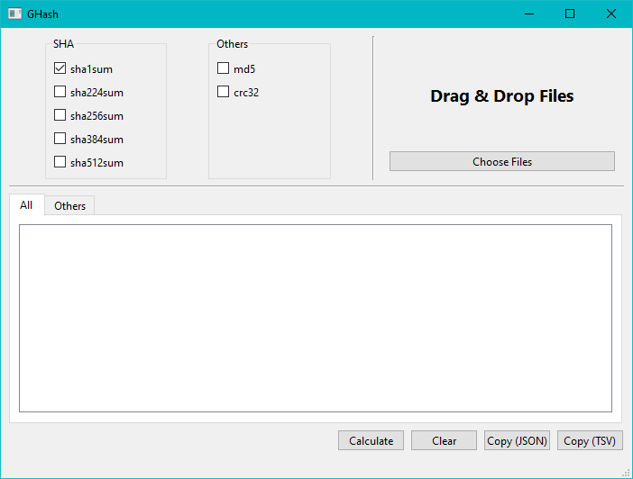

# GHash

## What it does

A program for calculating common checksums,



[ghash-demo-01.webm](https://user-images.githubusercontent.com/59538991/207211152-f384ac89-fbe2-46a8-a0e7-30f022fc55ba.webm)

Algorithms:

- sha1sum
- sha2sum
- sha2sum
- sha3sum
- sha5sum
- md5
- crc32

## Usage

```sh
# Build with poetry
poetry build

# Install with pipx
pipx install ./dist/ghash-X.X.X.whl
```
